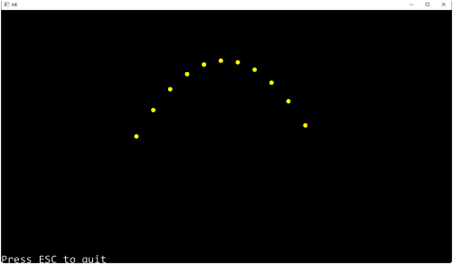

# Tutorial – Projectile Physics part 1: Analytical Solution
## Introduction and Objective:
In this tutorial, you will create a simple program to plot the path of a projectile by applying the kinematic formulas.

In the next tutorial (**Projectile Physics** Part 2: Numerical Integration), we will compare the results of this program with a projectile simulation using numerical integration (the method we’ll be implementing in our physics engine).

This is useful because:

1. doing this will reinforce the lecture material, and
2. it will help you understand the limitations of the discrete time step approximation, which just about all commercial physics engines use.

We will use the formulas presented in the [lecture](https://aie.instructure.com/courses/1493/pages/physics-for-games-projectile-physics-part-1) for this session to plot the path of a projectile using a known timestep.

## Prerequisites:
We are going to be using the DIY Physics engine that you have been writing.

Ensure you have completed the following tutorials:
- ***Tutorial 01 - Fixed Timestep*** – *a version is also available in the* ***Create a Physics Engine - Fixed Timestep*** *Tutorial page on canvas.*
- ***Tutorial 02 - Linear Force & Momentum*** – *a version is also available in the* ***Create a Physics Engine - Linear Force & Momentum session*** *Tutorial page on canvas.*
- ***Tutorial 03 - Collision Detection*** – *a version is also available in the*  ***Create a Physics Engine - Collision Detection*** *Tutorial page on canvas.*

If you have not completed these tutorials then you will need to do so before attempting this one, as it uses components that you will need to have already implemented.

## Simulating a Projectile Using Numerical Integration:
Remove any previous *Rigidbody* class instances you have in your scene. Alternatively, you may want to start a new project and add your *PhysicsScene* and *Rigidbody* classes to it.

For this tutorial, we won’t be simulating the projectile using a *Rigidbody* class object. Instead, we’ll calculate the position of the projectile over a period of time and add a circle gizmo at each timestep interval.

When the program draws the gizmos, it will draw all the gizmos at once – showing the full path of the projectile over the specified time period.

Create a function called *SetupConinuousDemo()* in your application class. This function will take as input the following arguments:
- The projectile’s initial position,
- The projectile’s initial angle (inclination),
- The projectile’s initial speed, and
- A gravity scalar

Using the formulas presented in the lecture, complete this function.

```c++
void PhysicsApp::SetupConinuousDemo(glm::vec2 startPos, float inclination, float speed, float gravity)
{
    float t = 0;
    float tStep = 0.5f;
    float radius = 1.0f;
    int segments = 12;
    glm::vec4 color = glm::vec4(1, 1, 0, 1);
    while (t <= 5)
    {
        // calculate the x, y position of the projectile at time t
        aie::Gizmos::add2DCircle(glm::vec2(x, y), radius, segments, color);
        t += tStep;
    }
}
```

Call the *SetupContinuousDemo()* function from your application’s *startup()* function, and ensure you are drawing the gizmos during the *draw()* function.

Because we’re only calling the *SetupContinuousDemo()* function once (at program launch), this means the gizmos are only being created once. If we leave the update() as it is, the *Gizmos::clear()* function will be called and we’ll end up not seeing any of the circles that plot the path of our projectile.

To get around this, rather than calling *SetupContinuousDemo()* every frame, we’ll simply remove the call to *Gizmos::clear()* during the update function. (Note that this will be necessary in the next tutorial, where we want to see each frame of a Rigidbody instance’s path that’s moving using our physics engine.

Ensure the *Gizmos::clear()* function is removed in the application’s update() function:
```c++
void PhysicsApp::update(float deltaTime) 
{
    // input example
    aie::Input* input = aie::Input::getInstance();
    //aie::Gizmos::clear();
    // update physics
    m_physicsScene->Update(deltaTime);
    m_physicsScene->Draw();
    // exit the application
    if (input->isKeyDown(aie::INPUT_KEY_ESCAPE))
        quit();
}
```

When you compile and run your program, your output should look similar to this:



In the sample above, the *SetupContinuousDemo()* function was called with a  starting position of (-40, 0), a speed of 40, inclination of 45 degrees, and gravity set to 10.

Experiment with different values for the input arguments and with different timesteps.
