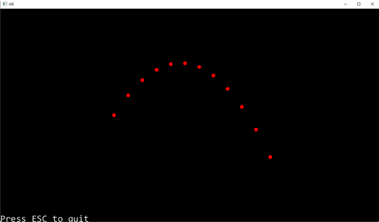
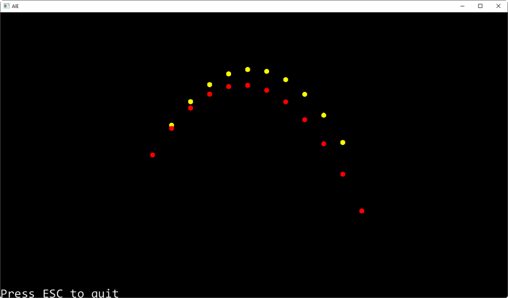

# Tutorial – Projectile Physics part 2: Numerical Integration

## Introduction and Objective:
In this tutorial, you will compare the results obtained from classical mechanics with those from your physics simulation.  

This tutorial continues on from part 1, where we calculated the path of a projectile using the kinematic formulas.

For part 2, we’ll add a *Rigidbody* class instance to use as our projectile, and give it the same speed and inclination as we used for our analytical solution. We’ll then compare the accuracy of the two approaches.

To read more about this topic go to this [lecture](https://aie.instructure.com/courses/1493/pages/physics-for-games-projectile-physics-part-2)

## Prerequisites:
We are going to be using the DIY Physics engine that you have been writing.

Ensure you have completed the following tutorials:
- ***Tutorial 01 - Fixed Timestep*** – *a version is also available in the* ***Create a Physics Engine - Fixed Timestep*** *Tutorial page on canvas.*
- ***Tutorial 02 - Linear Force & Momentum*** – *a version is also available in the* ***Create a Physics Engine - Linear Force & Momentum session*** *Tutorial page on canvas.*
- ***Tutorial 03 - Collision Detection*** – *a version is also available in the*  ***Create a Physics Engine - Collision Detection*** *Tutorial page on canvas.*
- ***Tutorial 03.1 - Projectile Physics Part 1*** – *a version is also available in the*  ***Things You Should Know - Projectile Physics 1*** *Presentation page on canvas.*


If you have not completed these tutorials then you will need to do so before attempting this one, as it uses components that you will need to have already implemented. 

## Simulating a Projectile Using Numerical Integration:
Load your project from the previous tutorial. Confirm it is currently plotting the path of a projectile using the kinematic formulas.

We’ll now simulate a projectile using the physics engine. This will use numerical integration to update the position of the projectile every physics update.

Starting at the position (-40, 0), give your projectile an initial speed of 30, and an inclination of 45 degrees:

```c++
m_physicsScene = new PhysicsScene();
m_physicsScene->SetGravity(glm::vec2(0, -10));
m_physicsScene->SetTimeStep(0.5f);

float radius = 1.0f;
float speed = 30;
glm::vec2 startPos(-40, 0);
float inclination = (float)M_PI / 4.0f;		// 45 degrees
	
m_physicsScene->AddActor(new Circle(
    startPos, inclination, speed, 1, radius, glm::vec4(1, 0, 0, 1)));
```

(this code should be placed in your application *startup()* function)

Before testing your application, ensure that your *Gizmos* aren’t being cleared at the beginning of each update loop. This step should have been done in the previous tutorial, but you may want to double check. We need to draw all previous frames at once to show all the path of our *Rigidbody* object over time.

Ensure the command to clear the *Gizmos* has been removed from the application’s *update()* function.

```c++
void PhysicsApp::update(float deltaTime) {
	// input example
	aie::Input* input = aie::Input::getInstance();

	//aie::Gizmos::clear();
	
	// update physics
	m_physicsScene->Update(deltaTime);
	m_physicsScene->Draw();

	// exit the application
	if (input->isKeyDown(aie::INPUT_KEY_ESCAPE))
		quit();
}
```

Test your application to ensure your projectile is visible and updates correctly. You should see the projectile (a red circle) arc across the screen.

You should end up with something similar to this:


 
If you wonder why only 12 frames appear on the screen, and why the projectile only seems to update once every half a second, go back and look at the physics timestep we specified during the *startup()* function.

The difference between numerical integration and discreet simulation becomes apparent once we compare the two approaches in the same application:

