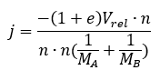
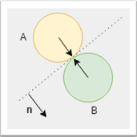

# Tutorial – Collision Resolution: Introduction

## Introduction and Objective:
In this tutorial we’re going to write a generic function to resolve collisions.

The math to do this is explained in the lecture slides for this session. We’ll implement this approach in code now, and in future lessons we’ll integrate this function into our existing application so that objects that collide can respond appropriately to those collisions.

## Prerequisites:
We will be using the DIY Physics engine that you have been writing.
Ensure you have completed the following tutorials:
- ***Tutorial 01 - Fixed Timestep*** – *a version is also available in the* ***Create a Physics Engine - Fixed Timestep*** *Tutorial page on canvas.*
- ***Tutorial 02 - Linear Force & Momentum*** – *a version is also available in the* ***Create a Physics Engine - Linear Force & Momentum session*** *Tutorial page on canvas.*
- ***Tutorial 03 - Collision Detection*** – *a version is also available in the*  ***Create a Physics Engine - Collision Detection*** *Tutorial page on canvas.*

Although recommended, it is not necessary to have completed the following previous tutorials:
- ***Tutorial 03.1 - Projectile Physics Part 1*** – *a version is also available in the*  ***Things You Should Know - Projectile Physics 1*** *Presentation page on canvas.*
- ***Tutorial 03.1 - Projectile Physics Part 2*** – *a version is also available in the*  ***Things You Should Know - Projectile Physics 2*** *Presentation page on canvas.*

## Resolving a Collision:
The math explaining the formulas involved in collision resolution is explained in the lecture slides, but for our purposes we only need the final formula listed at the end of the lecture:




This formula calculates the impulse magnitude (*j*). In other words, *j* is the magnitude of the force vector that needs to be applied to our colliding objects.

To put this into practice, we multiply *j* by *n* (the collision normal) to determine the force to apply to each rigidbody. For one of these collision objects we’ll apply the positive force, and for the other we apply the negative force. 

When this force is applied to the collision object via the *Rigidbody* class’s *ApplyForce()* function, the force will be divided by the object’s mass to calculate the correct final velocity.

---

Define a new function for your *Rigidbody* class as follows:

``` c++
void ResolveCollision(Rigidbody* actor2);
```

This function only accepts another rigidbody as an argument. This means that our collision response algorithm will be fairly simple, at least for now. 

We aren’t, for example, taking into consideration the contact point. We also won’t account for any angular velocity of the two objects, or the effective mass. This will simplify our algorithm at the expense of physical realism. In later tutorials we’ll look at how we can improve the accuracy and realism of this function.

The implementation of this function is as follows:

``` c++
void Rigidbody::ResolveCollision(Rigidbody* actor2)
{
	glm::vec2 normal = glm::normalize(actor2->GetPosition() - m_position);
	glm::vec2 relativeVelocity = actor2->GetVelocity() - m_velocity;

	// if the objects are already moving apart, we don't need to do anything
	if (glm::dot(normal, relativeVelocity) >= 0)
		return;

	float elasticity = 1;
	float j = glm::dot(-(1 + elasticity) * (relativeVelocity), normal) / ((1/GetMass()) + (1/actor2->GetMass()));

	glm::vec2 force = normal * j;

    ApplyForceToActor(actor2, force);
}
```

We start off by calculating the collision normal. In the image below, the collision normal is indicated by n. It is the normal of the plane along which the collision occurs (the dotted line).
 


In many physics engines this is usually returned by the collision detection function. Choosing a collision normal can be tricky. For the moment, just using circles, it will be sufficient to use the normalized difference in position (*posB - posA*). This is, in fact, what has been used in the image above.

After calculating the collision normal, we need the relative velocity between the two objects. To improve our physics engine we would want to determine the total velocity of both objects, which includes both linear and rotational velocity.

We then go ahead and calculate *j* as per our formula. Note that we are using a coefficient of elasticity (*e*) of 1. This means that no energy will be lost during the collision. 

If you wanted to model different physical materials, you could define values for each object and combine them to determine a coefficient of elasticity to use in your collision response algorithm, mimicking the way game engines like Unity3D work.

The line of code that calculates *j* (the impulse magnitude) is a bit long, but simply reflects the formula presented earlier. 

After calculating *j*, we multiply it by the collision normal (*n*). This gives us the force to apply to each object. This is done by calling the *ApplyForceToActor()* function we’ve previously written. (If you do not have this function an explanation and the code is given in the tutorial for **Linear Force and Momentum**.)

The *ApplyForceToActor()* function applies the negative force to this actor, and the positive force to actor2 (thus implementing the “equal and opposite” part of Newton’s third law).

We now have a collision resolution function that we can use to modify the velocities of the objects involved in a collision.

In the next tutorial we’ll cover how we can integrate this function into our exiting collision detection code, bringing the two systems together.

For now, explore the references and any web resources you find that explain similar approaches to collision resolution. <u>*Are there any improvements you can make to the function we just wrote?*</u>

## Next Tutorial:
**Collision Resolution – Circle to Circle** in Collision Response and Friction section