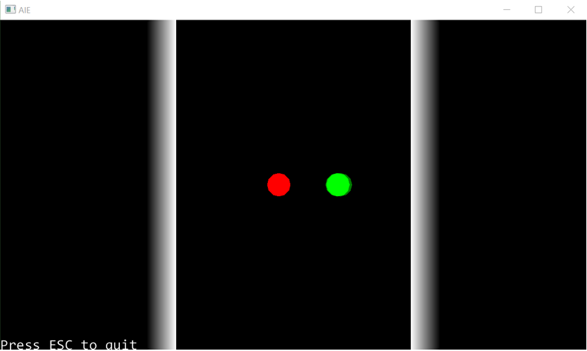

# Tutorial – Collision Response: Circle to Plane

## Introduction and Objective:
In this tutorial, we’ll implement the circle-to-plane collision as described in the lecture for this session. At the end of this tutorial you should be able to create physics simulations involving circle-to-circle collisions and circle-to-plane collisions.

## Prerequisites:
We will be using the DIY Physics engine that you have been writing.
Ensure you have completed the following tutorials:
- ***Tutorial 01 - Fixed Timestep*** – *a version is also available in the* ***Create a Physics Engine - Fixed Timestep*** *Tutorial page on canvas.*
- ***Tutorial 02 - Linear Force & Momentum*** – *a version is also available in the* ***Create a Physics Engine - Linear Force & Momentum session*** *Tutorial page on canvas.*
- ***Tutorial 03 - Collision Detection*** – *a version is also available in the*  ***Create a Physics Engine - Collision Detection*** *Tutorial page on canvas.*
- ***Tutorial 04 - Collision Resolution Part 1*** – *a version is also available in the*  ***Create a Physics Engine - Collision Resolution*** *Presentation page on canvas.*
- ***Tutorial 04 - Collision Resolution Part 2*** – *a version is also available in the*  ***Create a Physics Engine - Sphere to Sphere Collisions*** *Presentation page on canvas.*

Although recommended, it is not necessary to have completed the following previous tutorials:
- ***Tutorial 03.1 - Projectile Physics Part 1*** – *a version is also available in the*  ***Things You Should Know - Projectile Physics 1*** *Presentation page on canvas.*
- ***Tutorial 03.1 - Projectile Physics Part 2*** – *a version is also available in the*  ***Things You Should Know - Projectile Physics 2*** *Presentation page on canvas.*

## Circle-to-Plane Collision:
Our approach for implementing circle-to-plane collisions will be slightly different to that for circle-to-circle collisions. The reason is that the planes in our physics engine are static – they won’t move in response to a collision.

Our existing collision resolution function, *ResolveCollision()*, will modify the velocities of both objects involved in a collision. Obviously we don’t what this function to be modifying the velocity of the plane, as the plane itself is static.

But there is one more reason the existing *ResolveCollision()* function isn’t appropriate in this instance. Because the plane is static, it will effectively have infinite mass. This means that we can optimise the formula used to calculate the final velocity of the circle.

As explained in the slides for this lecture, the formula to calculate the impulse magnitude (*j*) now becomes:


There are many different ways we could modify our program to handle collisions with static objects.

We could add more checks inside the existing *ResolveCollision()* function, to see if any of the objects involved in the collision are static (or kinematic). We could remove the *ResolveCollision()* function and just handle everything on a case-by-case basis inside each collision detection function. Or, as we’ll see now, we could create a different *ResolveCollision()* function just for use with planes.

Inside the Plane class, create the following function:

``` c++
void Plane::ResolveCollision(Rigidbody* actor2)
{
}
```

You should be able to copy most of the logic for this function from the *Rigidbody::ResolveCollision()* function. In a circle-to-plane collision, we can use the plane’s normal as the collision normal.

Refer to the lecture slides and formula above to modify the calculation of the j variable in this function, or treat the plane’s mass as infinite, and work through eliminating terms (hint: the denominator simply becomes 1 over the mass of the circle).

To calculate the force, multiply *j* by the collision normal (i.e., the plane’s normal). This will give you the force to apply to the circle. You can call the circle’s *ApplyForce()* function, passing in this vector2 force value.

This should give you a complete *ResolveCollision()* function for the plane. The last step is to call this function from the circle-to-plane collision detection functions.

One thing to note is that because the *Plane* class does not inherit from the *Rigidbody* class, we can’t use virtual functions in this instance. We’ve simply made two functions in two classes that have the same name.

If you expect this to get a little confusing as you add more shapes to your physics engine, you may want to add the virtual function declaration to the *PhysicsObject* class. 

Go ahead and add one or more planes to your simulation. You should be able to create something in which circles collide with both planes and other circles. 

## Activity 1: Setting Up Newton’s Cradle
When ther is a collision between two balls of equal mass:
- One ball is stationary, and situated on the right hand side of the origin on the x-axis
- The other ball is moving at 1m/s along the x-axis, and is on the left hand side of the origin
- The coefficient of elasticity is 1
- Both balls weigh 1kg

Create a simulation that reproduces this problem. 

Run your simulation and use breakpoints to check if the velocities of your circles after the collision match the expected velocities. 

Them change the masses of the balls so one is drastically heavier than the other to verify that:
1. A heavy moving ball is not completely stopped when it hits a light ball.
2. A light moving ball bounces back from a collision with a heavy ball.

## Activity 2: Symmetrical Newton’s Cradle
Place two vertical planes as walls, and line up 5 perfectly elastic circles touching each other. Give the first one a velocity along the x-axis. You should observe Newton’s Cradle behaviour, with the balls on the left and right carrying all the momentum as they bounce back and forth into each other

## Activity 3: Asymmetrical Newton’s Cradle
Make one of the balls heavier and a different colour than the others. See what happens, and justify the behaviour to yourself in physical terms

## Kinetic and Potential Energy Diagnostics
You can now set up a simulation where a single fully-elastic bouncy ball is dropped on to a horizontal plane. The ball should bounce up and down, reaching the same height of apogee with each bounce.

In energy terms, we’re seeing an interchange between gravitational potential energy and linear kinetic energy. The ball has no kinetic energy when it reaches the top of its bounce, but being high up it has more gravitational potential energy. When it is at its lowest (hitting the floor) it has the least gravitational potential energy and the most kinetic energy.

Gravitational Potential Energy is expressed as 

***Eg = -mgh***

Where m = mass of the object, g is the gravitational field strength, and h is the height above the center of the gravitational field. We’re only interested in changes in potential energy, so we can use the Rigidbody’s position to get h.

Let’s put in some diagnostics for this.  We’ll need to access the gravity strength from the PhysicsScene, so we could make that variable and its public accessor static. (This will require a change to the PhysicScene constructor.) We can then add a GetPotentialEnergy() function to Rigidbody like so:

``` c++
float Rigidbody::GetPotentialEnergy()
{
	return -GetMass() * glm::dot(PhysicsScene::GetGravity(), GetPosition());
}

```

If you leave this running over lunchtime, or during a lecture, you’ll notice something odd – the ball keeps bouncing a little bit higher with each bounce!

We can put some hard unambiguous diagnostics into the *PhysicsScene* to calculate the total energy every frame to confirm this.

Put in a virtual *GetEnergy()* function into *PhysicsObject* that returns 0, and override it for *Rigidbody* to return the sum of kinetic and potential energy.

Use this to calculate the total energy in the scene:

``` c++
float PhysicsScene::GetTotalEnergy()
{
	float total = 0;
	for (auto it = m_actors.begin(); it != m_actors.end(); it++)
	{
		PhysicsObject* obj = *it;
		total += obj->GetEnergy();
	}
	return total;
}

```
Print this out every frame, and see what happens. As the ball bounces up and down, the total energy in the simulation rises very slowly.

Go back to the *Rigidbody::FixedUpdate* code and temporarily swap the order of the two lines around, so we apply gravity and then update the position. What happens to the total energy then?

It now decreases slowly!

What we’re observing here are limits of the simple forward-integration method we’re using. In reality, (or a simulation with an infinitesimally small timestep, the acceleration due to gravity happens gradually over 1/60th of a second. By dividing time up into discrete timesteps and applying the acceleration all at once, either at the start or the end of the timestep, we end up injecting or removing energy from the system.

This is not a huge problem for the type of simulations we’re making here. If we add a bit of extra energy in, we can remove it vis friction and drag later when we implement them. 

Commercial game engines use more sophisticated iterative solvers that don’t suffer from this problem, but are beyond the scope of this course to implement.

Make sure you revert your *Rigidbody* code to apply velocity to the position and then apply gravity. This is the better option because it makes resting objects behave more correctly, and we can counteract the addition of energy via friction.

## Testing the frame-smoothing code
We now have enough happening in our physics engine that we can test the frame smoothing code that we’ve written.

If you’ve got a Newton’s cradle or bouncing ball demo, see how it run when you increase the Physics timestep to give a cruder more coarse-grained simulation.

Change the physics timestep in *PhysicsApp::startup()* like so:

``` c++
m_physicsScene = new PhysicsScene();
m_physicsScene->SetTimeStep(0.1f);

```

This is a bit extreme – we’re only running 10 physics timesteps per second, and interpolating between them at draw time. Run like this and he behaviour should look reasonably smooth.

If you want a clearer look at what’s happening, add some temporary code to *Circle::Draw()* which shows the previous and next frame

``` c++
void Circle::Draw(float alpha)
{
	CalculateSmoothedPosition(alpha);

	// draw the physics frames at half alpha
	glm::vec4 halfColor = m_color;
	halfColor.a = 0.5f;
	aie::Gizmos::add2DCircle(m_position, m_radius, 12, halfColor);
	aie::Gizmos::add2DCircle(m_lastPosition, m_radius, 12, halfColor);

	aie::Gizmos::add2DCircle(m_smoothedPosition, m_radius, 12, m_color);
}
```

You should be able to see shadows like on the right of the green ball here that move less smoothly than the full color versions.



Comment this extra draw code out for now if you want, and restore the physics timestep to 0.01f (100 FPS) for now, and we’ll move on to adding rotation in the next tutorial.

## Next Tutorial:
Rotational Force Part 1 in Rotational Force section


